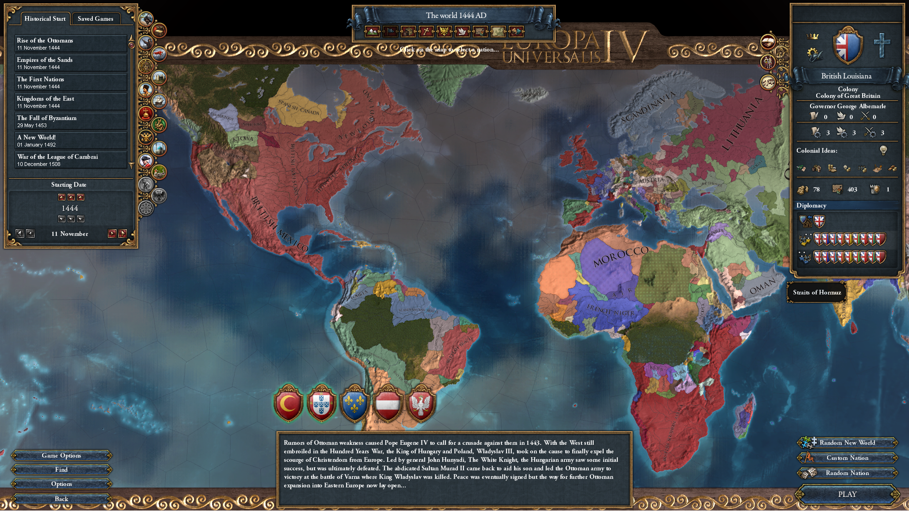

# EU3-to-EU4
My Experimental Project.. EU3 -> EU4 (using ParadoxGameConverters eu3 to vic2, eur4 to vic2 ) ?
for EU3 -> EU4, (EU4 -> VIC3) ?

# TODO AND DONE
    1. Province Mapping.  
        # done
        - owner 
        - controller
        - 1444.11.11 = { owner = target controller = target }
        - winner become owner and contrlloer in empty province of area (winner contains).
        # todo
        - country matching issue? - need to check country_matching.txt ?
        - states and territories
            - 수도가 위치한 대륙 - state, 그외 - territories..? 
    2. Revolt - To Do.
    3. Religion,  - To Do.
    
# Test
 
 
