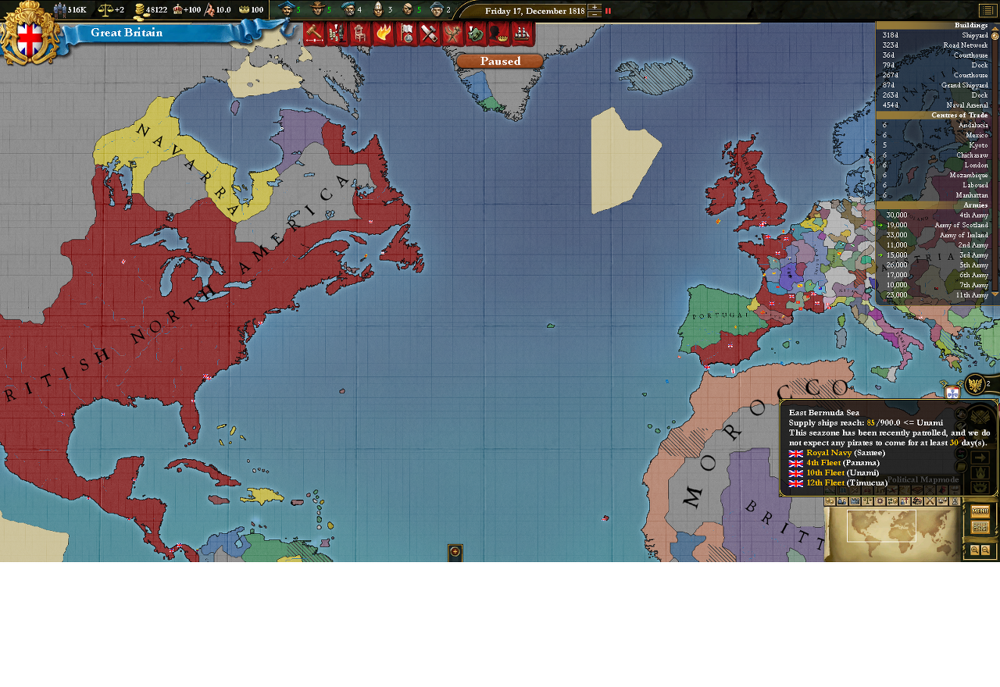

# EU3-to-EU4
My Experimental Project.. EU3 -> EU4 (using ParadoxGameConverters ) ?
for EU3 -> EU4, (EU4 -> VIC3) ?

# TODO AND DONE
    1. Province Mapping. - DONE? 
        - owner
        - controller
        - 1444.11.11 = { owner = target controller = target }
        - winner become owner and contrlloer in empty province of area (winner contains).
    2. Revolt - To Do.
    3. Religion,  - To Do.
    
# Test
 
 
